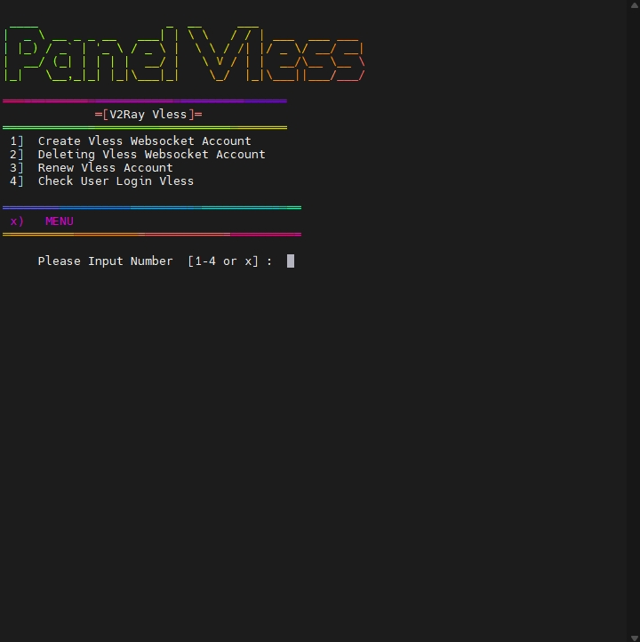

# autoscript

Step 1 : <br>

```shell
apt-get update && apt-get upgrade -y && update-grub && sleep 2 && reboot
```

Step 2 : <br><br>
```shell
rm -rf setup.sh && sysctl -w net.ipv6.conf.all.disable_ipv6=1 && sysctl -w net.ipv6.conf.default.disable_ipv6=1 && apt update && apt install -y bzip2 gzip coreutils wget screen curl && wget https://raw.githubusercontent.com/kevindoni/coba/main/kota/setup.sh && chmod +x setup.sh && ./setup.sh
```

# build up
oleh     : KEVIN DONI <br>
whatsapp : wa.me/082243698398 <br>
telegram : t.me/kevindoni
# Fitur

# Service & Port
   - OpenSSH                 : 22
   - OpenVPN                 : TCP 1194, UDP 2200, SSL 442
   - Stunnel4                : 902, 777
   - Dropbear                : 109, 143
   - WebSocket/WS SSL        : 443
   - WebSocket/WS Non SSL    : 2082
   - WebSocket/WS Ovpn       : 2086
   - Squid Proxy             : 3128, 8080 (limit to IP Server)
   - Badvpn                  : 7100, 7200, 7300
   - Nginx                   : 81
   - Wireguard               : 7070
   - L2TP/IPSEC VPN          : 1701
   - PPTP VPN                : 1732
   - SSTP VPN                : 444
   - Shadowsocks-R           : 1443-1543
   - SS-OBFS TLS             : 2443-2543
   - SS-OBFS HTTP            : 3443-3543
   - V2RAY Vmess TLS         : 8443
   - V2RAY Vmess None TLS    : 80
   - V2RAY Vless TLS         : 2083
   - V2RAY Vless None TLS    : 8880
   - Trojan                  : 2087
   - TrojanGO                : 2096

   # Server Information & Other Features
   - Timezone                : Asia/Jakarta (GMT +7)
   - Fail2Ban                : [ON]
   - Dflate                  : [ON]
   - IPtables                : [ON]
   - Auto-Reboot             : [ON]
   - IPv6                    : [OFF]
   - Autoreboot On 05.00 GMT +7
   - Autobackup Data
   - Restore Data
   - Auto Delete Expired Account
   - Full Orders For Various Services
   - White Label
   
[





